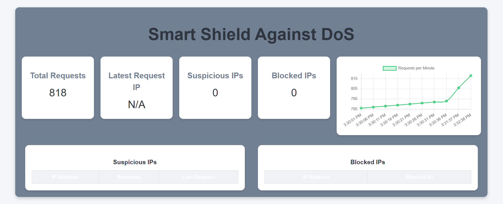

# Smart Shield Against DoS

A real-time dashboard to detect and block suspicious IPs making excessive requests. This project simulates network traffic, logs requests into MySQL, and classifies IPs as suspicious or blocked based on thresholds.

---

## Features

- Real-time monitoring dashboard (React + Chart.js)  
- MySQL database for logging requests  
- Express.js backend with REST APIs  
- Detects suspicious IPs (10+ requests per minute)  
- Automatically blocks IPs (20+ requests per minute)  
- Simulated IP requests for testing  

---

## Tech Stack

- **Frontend:** React, Axios, Chart.js  
- **Backend:** Node.js, Express.js  
- **Database:** MySQL (with `mysql2`)
---

---
---
### 1. Clone the repository
```bash
git clone https://github.com/AshwiniScripter/SmartShield.git
cd SmartShield


